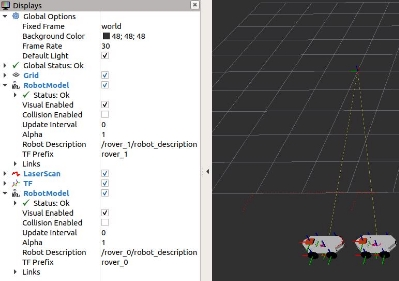
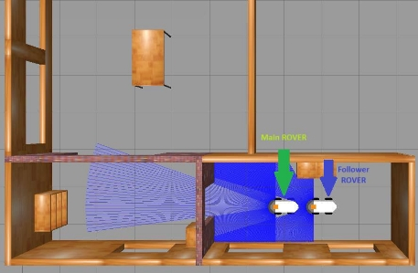
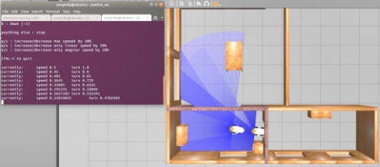
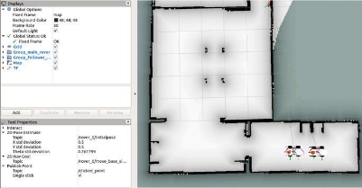
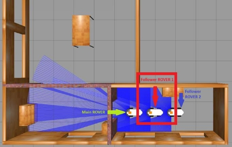
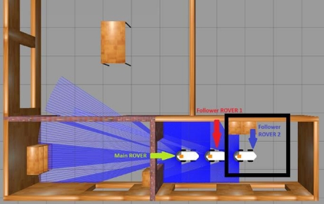
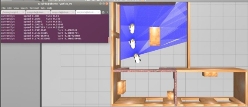

<h1 align="center">
  Follower ROVER
</h1>

[**Description**](#_page0_x82.00_y321.92)

[**Important information**](#_page0_x82.00_y391.92)

[**Characteristics**](#_page0_x82.00_y719.92)

[**Work cycle**](#_page1_x82.00_y147.92)

[**Operations for simulation execution**](#_page1_x82.00_y504.92)

- [**Operation for 1 follower ROVER and 1 main ROVER (teleoperation control)**](#_page1_x82.00_y546.92)

- [**Operation for 1 follower ROVER and 1 main ROVER (autonomous navigation)**](#_page3_x82.00_y550.92)

- [**Operation for 2 follower ROVERs and 1 main ROVER (teleoperation control)**](#_page5_x82.00_y324.92)

- [**Operation for 2 ROVER followers and 1 main ROVER (autonomous navigation)**](#_page7_x82.00_y261.92)

[**Operation for real life execution**](#_page8_x82.00_y604.92)

## **Description**

The project developed in ROS Melodic consists of the development of an algorithm that allows a ROVER to follow another ROVER that is in front. The algorithm does not focus on a particular robot, that is, the algorithm can be run on any ROVER, thus creating a chain of robot followers. 

## **Important information** 

- Subscriber and Publisher is a type of communication in ROS. 
- The cmd\_vel topic receives linear and angular velocity. 
- The LIDAR topic provides a list of 180 data, 1 data per angle. 
- It only subscribes to the LIDAR topic and publishes to the cmd\_vel topic. 
- It does not use Machine Learning or any computer vision cameras. 
- The algorithm separates the data into 5 regions, it always tries to have the main ROVER be in the front region (region 3). 

   

## **Characteristics** 

1. It  is  independent  whether  the  main  ROVER  executes  autonomous  navigation  or navigation through teleoperation. 
2. It can be run on N ROVER at the same time. 
2. Implements speed control by distance to the main ROVER. 
2. The follower ROVER always tries to position itself behind the main ROVER. 
2. The follower ROVER is located at a maximum distance of 0.5 meters from the main ROVER. 

## **Work cycle** 

  

## **Operations for simulation execution** 

**Operation for 1 follower ROVER and 1 main ROVER (teleoperation control)** 

1. Run the simulation: roslaunch main multi\_rover\_house.launch 

   There are more worlds where to execute them are as follows: 

    - roslaunch main multi\_rover\_empty.launch 
    - roslaunch main multi\_rover\_world.launch 

  

2. Run the follower algorithm (example with the robot named rover\_1): rosrun follower\_rover follower\_2.py NOMBRE\_ROVER 

   

3. Execute the teleoperation (example with the robot named rover\_0): rosrun teleop\_twist\_keyboar teleop\_twist\_keyboard.py cmd\_vel:=NAME\_ROBOT/cmd\_vel 

   

### **Operation for 1 follower ROVER and 1 main ROVER (autonomous navigation)** 

1. Run the simulation: roslaunch main multi\_rover\_house.launch navigation:=true 

   There are more worlds where to execute them are as follows: 

    - roslaunch main multi\_rover\_empty.launch navigation:=true 
    - roslaunch main multi\_rover\_world.launch navigation:=true 

  

2. Run the follower algorithm (example with the robot named rover\_1): rosrun follower\_rover follower\_2.py NOMBRE\_ROVER 

   

### **Operation for 2 follower ROVERs and 1 main ROVER (teleoperation control)** 

1. Run the simulation: roslaunch main multi\_rover\_house.launch 

   There are more worlds where to execute them are as follows: 

    - roslaunch main multi\_rover\_empty.launch 
    - roslaunch main multi\_rover\_world.launch 

   

2. Run the follower algorithm for rover\_1: rosrun follower\_rover follower\_2.py rover\_1 

   

3. Run the follower algorithm for rover\_2: rosrun follower\_rover follower\_2.py rover\_2 

   

4. Execute the teleoperation (example with the robot named rover\_0): rosrun teleop\_twist\_keyboar teleop\_twist\_keyboard.py cmd\_vel:=NAME\_ROBOT/cmd\_vel 

   

### **Operation for 2 ROVER followers and 1 main ROVER (autonomous navigation)** 

1. Run the simulation: roslaunch main multi\_rover\_house.launch navigation:=true 

   There are more worlds where to execute them are as follows: 

    - roslaunch main multi\_rover\_empty.launch navigation:=true 
    - roslaunch main multi\_rover\_world.launch navigation:=true 

   

2. Run the follower algorithm for rover\_1: rosrun follower\_rover follower\_2.py rover\_1 

   

3. Run the follower algorithm for rover\_2: rosrun follower\_rover follower\_2.py rover\_2 

   

## **Operation for real life execution** 

1. Run everything necessary for the main ROVER. The algorithm is independent of what the main ROVER executes and how it executes it. 
1. Run everything necessary for the ROVER follower. 
1. Run the follower algorithm for the corresponding ROVER: rosrun follower\_rover follower\_2.py ROVER\_NAME 
1. If you want to run the code on more than 1 robot, repeat steps 2 and 3 for the other followers. 

[ref1]: Aspose.Words.18b9b6ee-fb8e-4997-9477-eb8b4bd4bbb8.003.jpeg
[ref2]: Aspose.Words.18b9b6ee-fb8e-4997-9477-eb8b4bd4bbb8.005.jpeg
[ref3]: Aspose.Words.18b9b6ee-fb8e-4997-9477-eb8b4bd4bbb8.008.jpeg
[ref4]: Aspose.Words.18b9b6ee-fb8e-4997-9477-eb8b4bd4bbb8.009.jpeg
[ref5]: Aspose.Words.18b9b6ee-fb8e-4997-9477-eb8b4bd4bbb8.010.jpeg
